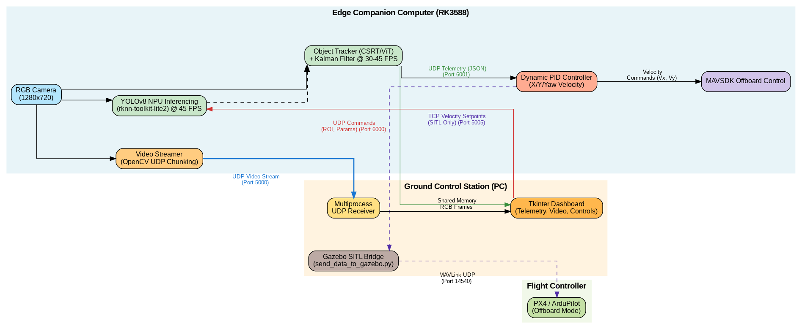
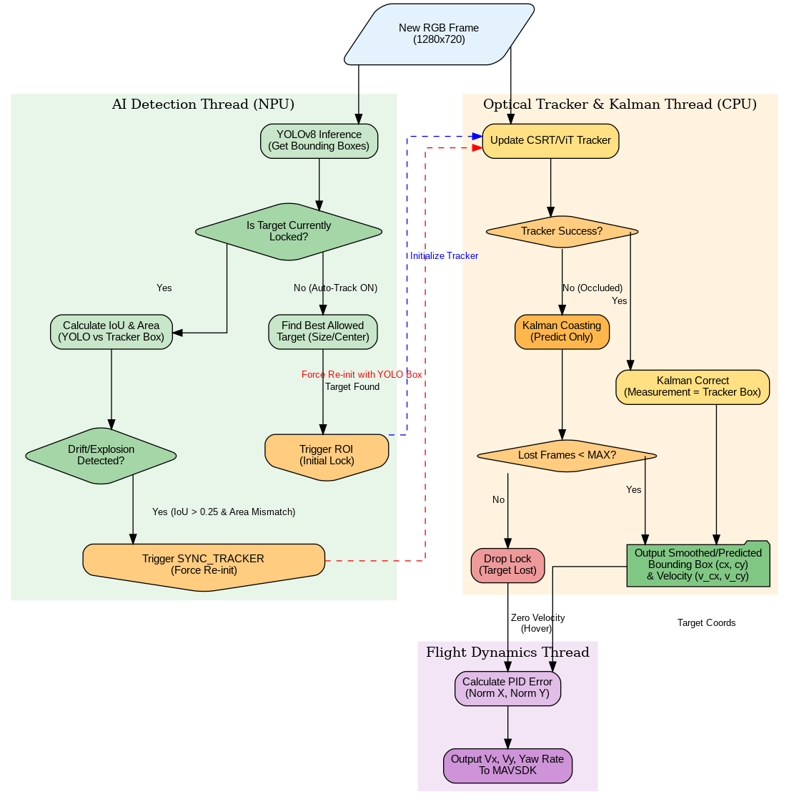

# 🚁 RK3588 UAV Target Tracking

A complete **Edge AI framework** for autonomous UAV target tracking using **YOLOv8**, **hybrid object tracking**, **Kalman prediction**, and **MAVLink communication**. The system is optimized for **RK3588 NPU** acceleration and includes an interactive **Ground Control Station (GCS)** for target selection, telemetry monitoring, and controller tuning.

---

# Demo

<p align="center">
  
</p>

<p align="center">
  <em>
  Real-time UAV target tracking using YOLOv8, hybrid object tracking,
  Kalman prediction and RK3588 NPU acceleration.
  </em>
</p>

---


# System Architecture

The framework is divided into two independent components:

- **Edge AI Module (RK3588)**
- **Ground Control Station (PC)**

<p align="center">
  
</p>

The RK3588 companion computer performs object detection, target tracking, Kalman prediction, and communicates with the flight controller through MAVLink, while the Ground Control Station provides an intuitive interface for visualization and parameter tuning.

---

# Hybrid Tracking Pipeline

<p align="center">
  
</p>

The target tracking framework combines multiple modules to maximize robustness during high-speed UAV operation.

### Tracking Pipeline

1. YOLOv8 detects vehicles.
2. User selects a target from the Ground Control Station.
3. A visual tracker (CSRT or ViT) follows the target.
4. Kalman Filter predicts target motion during temporary tracking failures.
5. The detector re-initializes the tracker when the target is recovered.
6. PID controller generates flight commands for autonomous target following.

---

# Features

- 🚀 RK3588 NPU acceleration
- 🎯 YOLOv8 Nano & Small (INT8)
- 📷 Real-time object detection
- 🔄 Hybrid tracking (CSRT / ViT)
- 📈 Kalman Filter target prediction
- 🛰 MAVLink communication
- 🎮 Interactive Ground Control Station
- ⚙️ Online PID parameter tuning
- 📡 Live video streaming
- 🌍 Gazebo simulation support
- 🚁 Compatible with PX4 flight controllers

---

# Performance

| Model | Precision | FPS |
|-------|-----------|----:|
| YOLOv8 Nano | INT8 | **45 FPS** |
| YOLOv8 Small | INT8 | **20 FPS** |

---

# Hardware Requirements

- RK3588-based board (Orange Pi 5, Radxa Rock 5B, NanoPC-T6, Firefly, etc.)
- PX4 Flight Controller
- USB/UART connection
- Ground Control Station (Windows/Linux/macOS)

---

# Installation

## Clone Repository

```bash
git clone https://github.com/mehdighasemzadeh/Quadcopter-Tracking-RK3588.git

cd Quadcopter-Tracking-RK3588
```

## Ground Control Station

```bash
pip install opencv-python numpy tk mavsdk asyncio
```

## RK3588 Companion Computer

```bash
pip install opencv-python opencv-contrib-python numpy psutil asyncio mavsdk
```

Install RKNN Toolkit Lite:

```bash
pip install rknn_toolkit_lite2-1.6.0-cp38-cp38-linux_aarch64.whl
```

---

# Running the System

## Step 1 — Boost RK3588 Performance

```bash
cd RK3588

sudo chmod +x boost.sh

sudo ./boost.sh
```

---

## Step 2 — Configure Network

Update the IP addresses inside the configuration files to match your Ground Control Station.

---

## Step 3 — Gazebo Simulation

Run the bridge:

```bash
python Station/send_data_to_gazebo.py
```

Launch the Ground Station:

```bash
python Station/station.py
```

Start the UAV software:

```bash
cd RK3588

python quadcopter.py
```

---

## Step 4 — Real Flight

1. Connect RK3588 to the flight controller.
2. Set

```python
Gazebo_sim = False
```

3. Configure the MAVLink port.
4. Launch the Ground Station.
5. Run

```bash
python quadcopter.py
```

---

# Repository Structure

```text
RK3588-UAV-Tracker/
│
├── images/
│   ├── demo.gif
│   ├── demo.mp4
│   ├── gcs.png
│   ├── architecture.png
│   └── tracking_flow.png
│
├── RK3588/
│   ├── py_utils/
│   ├── boost.sh
│   ├── quadcopter.py
│   ├── yolo.py
│   ├── yolov8n.rknn
│   └── yolov8s.rknn
│
├── Station/
│   ├── station.py
│   └── send_data_to_gazebo.py
│
├── README.md
└── LICENSE
```

---

# Future Work

- Multi-object tracking
- Deep Re-Identification
- Adaptive controller
- Multi-UAV coordination
- YOLO11 support
- TensorRT deployment


---

# Acknowledgements

This repository presents an open-source implementation of a real-time UAV target tracking framework developed for educational and research purposes. Some proprietary components from the original industrial system have been replaced with simplified open-source alternatives.
